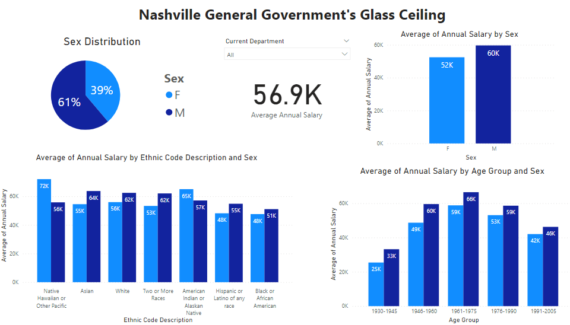

# TN Govt Glass Ceiling Dashboard

The main product of this repo is the Glass_Ceiling_Dashboard.pbix file examining gender-based pay gaps with attention to ethnicity and age. This interactive PowerBI dashboard is based on data from Metro Nashville's HR workforce demographics report acquired here on June 15, 2021: https://data.nashville.gov/General-Government/General-Government-Employees-Demographics/4ibi-mxs4

The dashboard features:
- the average salary of all employees in the dataset
- a pie chart of the Male/Female distribution
- a bar graph of the average salary for each sex
- a bar graph of average salary broken down by ethnicity and sex
- a bar graph of average salary broken down by age-range and sex
- interactive filtering between all visuals (ex: clicking the bar for Asian female average salary highlights parts of the other graphs that represent these Asian females)
- a drop down list of government departments that can be drilled into for displaying department-specific data on all graphs

# Technologies
- Excel
- PowerBI

# Procedures
- aqcuiring the data and corresponding data dictionary (included in repo data folder)
- adding a calculated 'Age Group' column in excel using an `=IFS()` function on the 'Year of Birth' column
- importing the data into PowerBI and adjusting salary data type to currency
- creating the visuals, filters, and drill down for the dashboard
- presenting the information to Data Analytics instructors with examples of departments that have varying degrees of demographic diversity and pay equity
